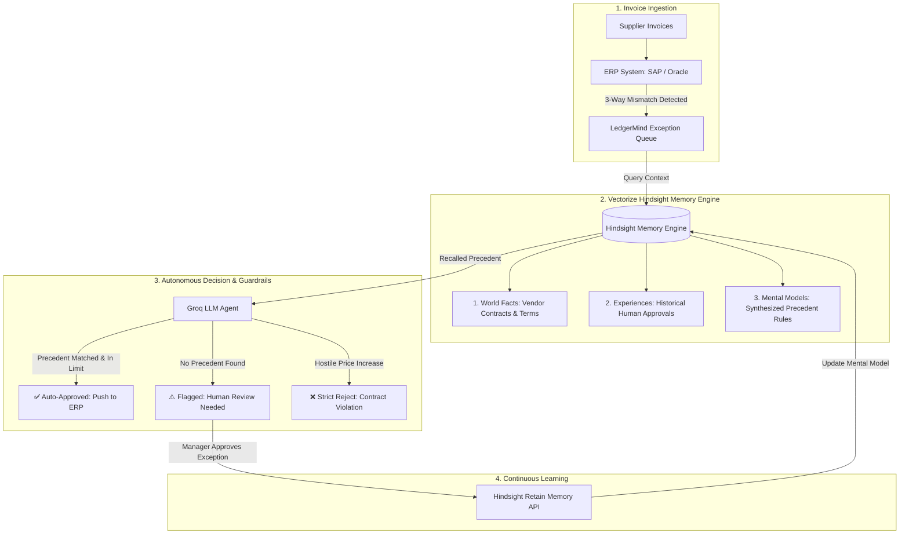

# LedgerMind — Autonomous FinOps Precedent Engine

> **Biomimetic Agent Memory for Accounts Payable & Vendor Exception Resolution**  
> Powered by **Vectorize Hindsight** and **Groq**.

[-emerald.svg)](https://en.wikipedia.org/wiki/Indian_rupee)

---

## 🌐 Live Web Application

* **Live Demo URL:** `(https://ledgermind-2ybj.onrender.com/)` *(or your custom Render link)*
* **Built With:** Python Flask, Tailwind CSS, Vectorize Hindsight Memory, Groq LLM API.

---

## 📌 Executive Summary & Problem Statement

In corporate finance operations, up to **20% of supplier invoices** trigger discrepancy flags against original Purchase Orders—often due to emergency freight fees, statutory green cesses, or seasonal delivery surcharges.

Traditional Enterprise Resource Planning (ERP) systems like SAP and Oracle are strictly binary: either an invoice matches 100%, or it is frozen. Accounts Payable (AP) specialists waste dozens of hours each week sending emails to ask: *"Did we approve this extra fee last month?"*

Standard LLMs cannot solve this because they suffer from **session amnesia**—each new prompt starts from scratch, forgetting past managerial approvals and forcing humans into the same repetitive loops.

### The Solution: LedgerMind
**LedgerMind** is an autonomous FinOps copilot powered by **Vectorize Hindsight**. It acts as an **institutional precedent engine**:
1. When a human manager approves an exception, Hindsight retains the decision as an active business precedent.
2. When recurring invoices arrive from that supplier, LedgerMind recalls the past authorization, checks policy boundaries, and **auto-approves compliant discrepancies in under 1 second**.
3. It enforces strict guardrails: if a supplier attempts an unauthorized unit price increase, LedgerMind immediately intercepts it as a contract violation.

---

## 🏗️ System Architecture & Workflow

---

## 🧠 Biomimetic Memory Architecture (Vectorize Hindsight)

Unlike static databases or naive vector search (RAG) that simply match keywords, Vectorize Hindsight operates on a 3-layer biomimetic memory structure:

| Layer | What It Stores | Real Example in LedgerMind |
| :--- | :--- | :--- |
| **1. World Facts** | Static entity metadata, PO baseline terms, agreed unit pricing. | *"Acme Industrial is a Tier-1 hardware vendor under Net-30 terms with PO-4401."* |
| **2. Experiences** | Episodic records of human managerial decisions. | *"Sarah Jenkins (Finance Lead) approved ₹3,500 rush freight on Oct 12."* |
| **3. Mental Models** | Synthesized organizational rules and tolerance boundaries. | *"For Acme Industrial, expedited freight surcharges up to ₹4,000 are pre-authorized during the warehouse relocation."* |

---

## ⚡ The Before-vs-After Memory Demonstration

The power of persistent memory is proven through a 3-stage progression:

| Scenario | Stateless Baseline (Without Memory) | LedgerMind (With Vectorize Hindsight) |
| :--- | :--- | :--- |
| **Interaction 1: First Encounter** | Surcharge not on PO. Payment frozen. Requests human review. | Flags fee. Human approves with note: *"Approved rush freight up to ₹4,000 for warehouse move."* **Hindsight learns.** |
| **Interaction 2: Recurring Surcharge** | **Complete Amnesia:** Flags the exact same ₹3,500 fee again. Requires identical email exchange. | **Auto-Approved (96% Confidence):** Recalls Sarah Jenkins' rule, verifies ₹3,500 $\le$ ₹4,000, and clears payment instantly. |
| **Interaction 3: Unauthorized Price Hike** | Cannot evaluate whether a 10% unit price increase is authorized. | **Strict Intercept:** Detects ₹12,000 unit price variance. Rejects approval because zero precedent allows price increases. |

---

## 💼 Business Impact & ROI

* **70% Reduction in AP Exception Bottlenecks:** Routine, approved variances are cleared automatically without human email ping-pong.
* **Elimination of Late-Payment Penalties:** Suppliers are paid on time, preserving crucial supply chain relationships.
* **Audit-Proof Decision Trails:** Every automated approval includes a direct citation to the original human author, timestamp, and policy justification.

---

## 🚀 Live Demo

LedgerMind is deployed as a web application and can be accessed directly
without any local setup.

### 🌐 Launch the Application

**Live Website:** (https://ledgermind-2ybj.onrender.com/)

The deployed application provides an interactive demonstration of:

- Invoice exception detection
- Hindsight-based precedent recall
- Human approval and memory retention
- Repeated invoice evaluation
- Guardrail-based exception handling

> **Note:** The application uses synthetic data for demonstration purposes.

## 👥 Engineering & Research Squad

* **Lead AI & Backend Architect:** System architecture, Flask REST API, Vectorize Hindsight biomimetic memory pipeline, Groq LLM orchestration.
* **Frontend Lead:** Enterprise FinOps dashboard, responsive UI, status badge hierarchy.
* **Integration & QA:** Real-time state synchronization, end-to-end verification test suite.
* **FinOps Research Lead:** Synthetic corporate dataset design, business exception scenarios.
* **Media & Documentation:** Technical whitepaper, video production, and architectural documentation.

---

## 📄 License

Distributed under the MIT License. See `LICENSE` for details.
